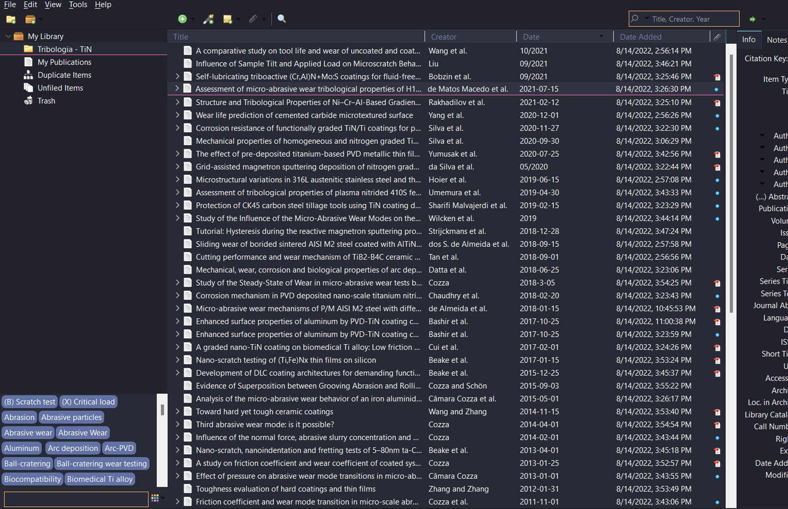

# Dracula for [Zotero](https://www.zotero.org/)

> A dark theme for [Zotero](https://www.zotero.org/).



## Install
1. go to ```C:\Users\User_name\AppData\Roaming\Zotero\Zotero\Profiles\user_profile.default\```
2. create a ```chrome``` folder
3. paste ```userChrome.css``` inside chrome folder.
All instructions can be found at [draculatheme.com/Zotero](https://draculatheme.com/Zotero).

## Team

This theme is maintained by the following person(s) and a bunch of [awesome contributors](https://github.com/dracula/foobar/graphs/contributors).

| [](https://github.com/omanuelcosta) |
| ---------------------------------------------------------------------------------------- |
| [Juan Costa](https://github.com/zenorocha)                                               |

## Community

- [Twitter](https://twitter.com/draculatheme) - Best for getting updates about themes and new stuff.
- [GitHub](https://github.com/dracula/dracula-theme/discussions) - Best for asking questions and discussing issues.
- [Discord](https://draculatheme.com/discord-invite) - Best for hanging out with the community.

## License

[MIT License](./LICENSE)
